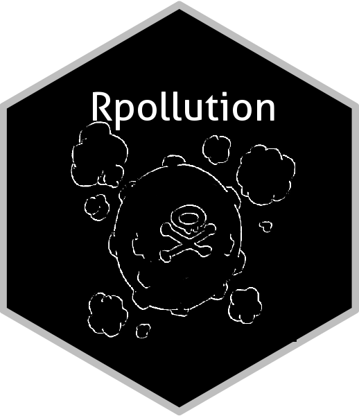

```{r, echo = FALSE}
knitr::opts_chunk$set(
  collapse = TRUE,
  comment = "#>",
  message = FALSE
)
```

# koffing 

The goal of `koffing` is to assemble R functions to catch (scrape) air pollution data. `koffing` is from the same creator of the blog [Rpollution](https://rpollution.com).

## Installation

You can install `koffing` from github with:

```{r gh-installation, eval = FALSE}
# install.packages("devtools")
devtools::install_github("atmoschem/koffing")
```

## CETESB scraper

To scrape data from the CETESB qualar system, use the function `scraper_cetesb()`.

```{r example, eval = FALSE}
library(koffing)

koffing::scraper_cetesb(
  parameter = 99, 
  station = 17, 
  start = "01/01/2018", 
  end = "31/01/2018", 
  login = "login", 
  password = "password"
)
```

If you substitute the values `login` and `password` by your login and password from the Qualar system, this example will return the hourly NO concentrations from the Pinheiros station for January 2018.
